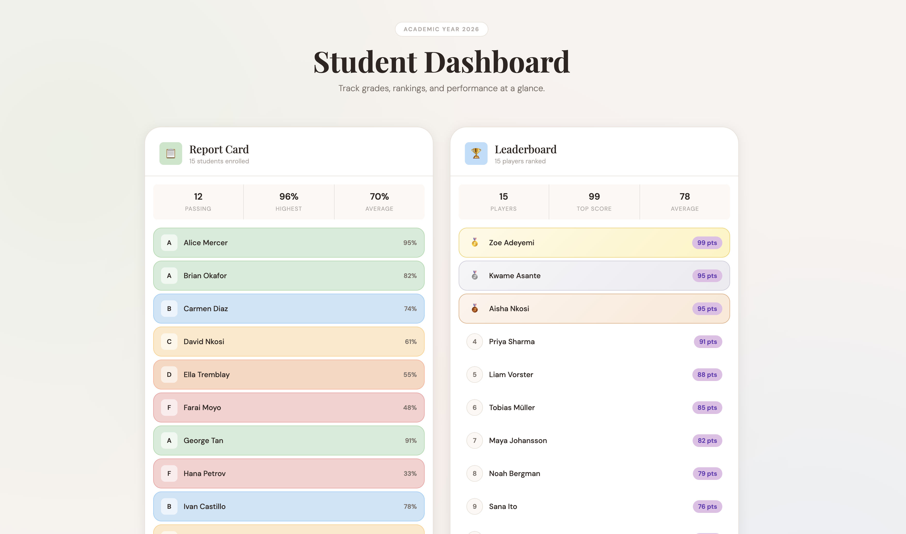

# Student Dashboard

A React + TypeScript dashboard that displays a **Report Card** and a **Leaderboard** side by side, styled with a warm pastel design system.

---

## Project Structure

```
src/
├── components/
│   ├── ReportCard.tsx       # Displays student grades with pass/fail colour coding
│   └── Leaderboard.tsx      # Ranks players by score with medal highlights
├── utils/
│   └── utils.ts             # GetGrade() — maps a numeric score to a letter grade
├── styles/
│   └── index.css            # Full design system (CSS variables, layout, animations)
└── main.tsx                 # App entry point with sample data
```

---

## Components

### `<ReportCard students={...} />`

Accepts an array of students and renders a colour-coded grade list.

| Prop | Type | Description |
|------|------|-------------|
| `students` | `Student[]` | Array of `{ name: string; grade: number }` |

- Grades are mapped to letter grades (A–F) and background colours via `GetGrade()`.
- The stats bar shows **passing count**, **highest grade**, and **class average**.

### `<Leaderboard players={...} />`

Accepts an array of players, sorts them by score descending, and renders a ranked list.

| Prop | Type | Description |
|------|------|-------------|
| `players` | `Player[]` | Array of `{ name: string; score: number }` |

- Top 3 players receive 🥇 🥈 🥉 medal badges and gold/silver/bronze row styling.
- Each row includes a proportional score bar relative to the top score.
- The stats bar shows **player count**, **top score**, and **average score**.

---

## Utility

### `GetGrade(grade: number): GradeInfo`

Located in `src/utils/utils.ts`.

| Score Range | Letter | CSS Class |
|-------------|--------|-----------|
| 80–100 | A | `PassA` |
| 70–79 | B | `PassB` |
| 60–69 | C | `PassC` |
| 50–59 | D | `PassD` |
| 0–49 | F | `Fail` |

Returns `{ gradeLabel: string, className: string }`.

---

## Styling

All styles live in `src/styles/index.css` and use CSS custom properties.

Key design tokens:

```css
--bg: #f7f3ef          /* warm off-white page background */
--surface: #ffffff      /* card backgrounds */
--border: #e8e0d8       /* subtle warm borders */
--radius-xl: 32px       /* panel corner radius */
```

Grade colours (`--grade-a` through `--grade-fail`) and medal colours (`--gold`, `--silver`, `--bronze`) are also defined as variables for easy theming.

The layout uses a **two-column CSS Grid** that collapses to a single column below `860px`.

---

## Getting Started

```bash
npm install
npm run dev
```

Requires **React 18+** and **TypeScript**. No additional dependencies beyond a standard Vite + React scaffold.

---

## Sample Data

`main.tsx` ships with 15 pre-populated students and 15 players. Replace the `students` and `players` arrays with your own data — the components handle sorting and stat calculation automatically.
